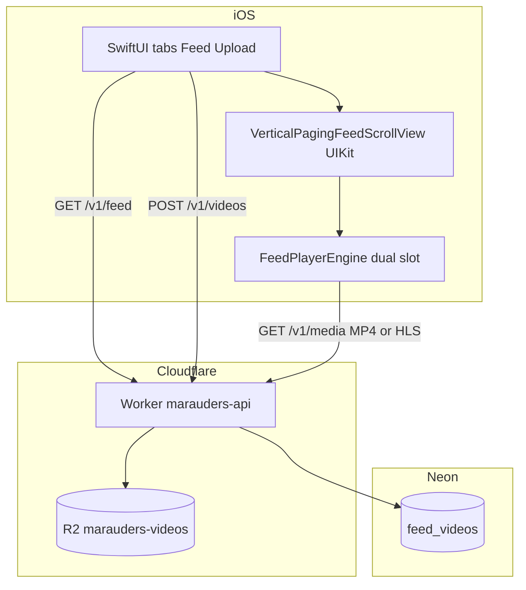
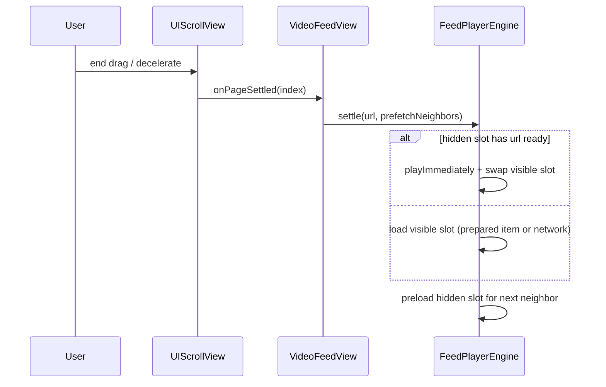

# Marauders — Architecture

Portfolio vertical-video app: **SwiftUI + AVFoundation** on iOS, **Cloudflare Workers + R2 + Neon** on the backend.

**Related:** [docs/adr/](docs/adr/) (decision records) · [deployment/video-pipeline.md](deployment/video-pipeline.md) (faststart, HLS)

## System context



| Surface | Responsibility |
|---------|----------------|
| `GET /v1/feed` | Paginated list of `{ id, streamURL }` |
| `POST /v1/videos` | Multipart `file` → R2 + DB row |
| `GET /v1/media/{key}` | Progressive MP4/MOV (**Range 206**) or HLS playlist + `.ts` segments |

---

## Trust boundaries

```text
┌─────────────────────────────────────────────────────────┐
│  iOS app (untrusted client)                             │
│  · HTTPS-only playback URLs                             │
│  · No secrets in repo; API base URL in plist            │
│  · Debug log tab: DEBUG builds only                     │
└───────────────────────────┬─────────────────────────────┘
                            │ TLS
┌───────────────────────────▼─────────────────────────────┐
│  Cloudflare Worker (validation, authz: public read)     │
│  · Reject invalid paths, MIME, size                     │
│  · DATABASE_URL via wrangler secret                     │
└───────────────┬─────────────────────┬───────────────────┘
                │                     │
         ┌──────▼──────┐       ┌──────▼──────┐
         │ Neon Postgres│       │ R2 bucket   │
         │ feed metadata│       │ video bytes │
         └─────────────┘       └─────────────┘
```

| Zone | Sensitive data | Controls |
|------|----------------|----------|
| iOS | None stored | ATS HTTPS; fail closed on non-HTTPS `streamURL` |
| Worker | `DATABASE_URL` | Secret binding; input validation on upload |
| R2 | Video objects | Key allowlist `videos/{uuid}.mp4` or `videos/{uuid}/…` |
| Neon | `stream_url`, feed rows | Parameterized SQL; pooled connection string |

---

## iOS — feed playback

See **[ADR-001: UIKit paging + dual AVPlayer](docs/adr/001-feed-playback-dual-player.md)** for options and tradeoffs.

### Problem (historical)

Per-cell `AVPlayer` instances caused teardown races. A single player in a fixed SwiftUI overlay did not scroll with the finger and stuttered on `replaceCurrentItem` when the page changed.

### Current design

| Piece | Role |
|-------|------|
| `VerticalPagingFeedScrollView` | `UIScrollView` + `isPagingEnabled`; black page placeholders |
| `FeedPlayerCompositorView` | Two `AVPlayerLayer` hosts (slot A / B); visible slot on top |
| `FeedPlayerEngine` | Dual `AVPlayer`, prefetch cache, `settle(on:prefetchNeighbors:)` |
| `VideoFeedView` | SwiftUI chrome, buffering overlay, tap → play/pause |

The compositor is a **subview of the scroll view’s content**, positioned at `y = playbackPageIndex × pageHeight`, so video moves with the user during a drag.

### Settle sequence (after finger release)



### Prefetch

- `prefetch` / `warmURLs` build `AVPlayerItem` until **readyToPlay** (cached by URL).
- On settle, visible slot prefers **prepared items**; hidden slot preloads the **next** neighbor (paused at zero).
- Buffering UI appears only after **~380 ms** of stall.

### UX / lifecycle

- **Tap** toggles play/pause (`FeedPlayerPhase.paused` when user-initiated).
- `AppRootView` splash (~650 ms min) + `loadIfNeeded` during splash.
- `scenePhase` / tab disappear → `pause()`; active → `settle` again.

### Upload path (client)

`PhotosPicker` → `VideoExportService` (H.264 720p MP4) → `POST /v1/videos`.

### Module map

```text
Marauders-ios/Marauders/
  Splash/         AppRootView, SplashView
  Feed/           VideoFeedView, VerticalPagingFeedScrollView,
                  FeedPlayerEngine, FeedPlayerCompositorView,
                  FeedPlayerLayerHost, FeedPlaybackChrome
  Upload/         UploadVideoView, VideoExportService
  Networking/     FeedAPIClient, VideoUploadAPIClient
  Logging/        AppLog, DebugLogView (#if DEBUG tab only)
```

---

## Backend — video on write and read

### Upload

1. Validate multipart `file` (size, MIME).
2. For MP4 ≤ 80 MB: **faststart** remux (`moov` before `mdat`) in the Worker.
3. `put` to R2; insert `stream_url` → `/v1/media/videos/{object-uuid}.mp4`.

`feed_videos.id` (row UUID) **≠** R2 object UUID in the path; both appear in API responses.

### HLS (optional, ops script)

`npm run video:hls -- <feed_videos.id>` downloads the row’s current MP4 (if needed), ffmpeg → `videos/{object-uuid}/master.m3u8` + `segNNN.ts`, updates `stream_url`. AVPlayer needs no app change.

### Media GET

- Keys: `videos/{uuid}.mp4|mov`, `videos/{uuid}/master.m3u8`, `videos/{uuid}/segNNN.ts`
- `Accept-Ranges: bytes`, `ETag` / `304`, `Content-Disposition: inline`

### Operational scripts

| Script | Purpose |
|--------|---------|
| `npm run db:purge` | Clear `feed_videos` + delete R2 objects referenced by URLs |
| `npm run video:hls` | ffmpeg HLS from feed row → R2 + update `stream_url` |

---

## Failure modes

| Symptom | Likely cause | Mitigation |
|---------|----------------|------------|
| Spinner forever | Bad `stream_url`, 404 media | In-app retry; fix DB/R2; `db:purge` |
| Hitch on release only | Next clip not in hidden slot | Wait on clip for prefetch; HLS; `video:hls` |
| Scroll smooth but black gap | Empty feed | Empty-state UX (planned) |
| Slow MP4 start | No faststart / large file | Re-upload; HLS script |
| Mixed HLS + MP4 in feed | By design during migration | Convert remaining rows with `video:hls` |

---

## Future (not implemented)

- Empty-state feed UI when `items.length === 0`
- Auth + per-user upload quotas
- Automatic HLS transcode queue (Worker Queue + ffmpeg worker)
- Metrics: time-to-first-frame after settle, rebuffer count
- Adaptive HLS ladder (multi-bitrate `master.m3u8`)
- Offline cache / `AVAssetDownloadTask`

---

## Tests

- `MaraudersTests/FeedPlayerEngineTests.swift` — HTTPS policy, pause semantics, retry (no network).
- Run: Xcode **Product → Test** or `xcodebuild test -scheme Marauders`.
