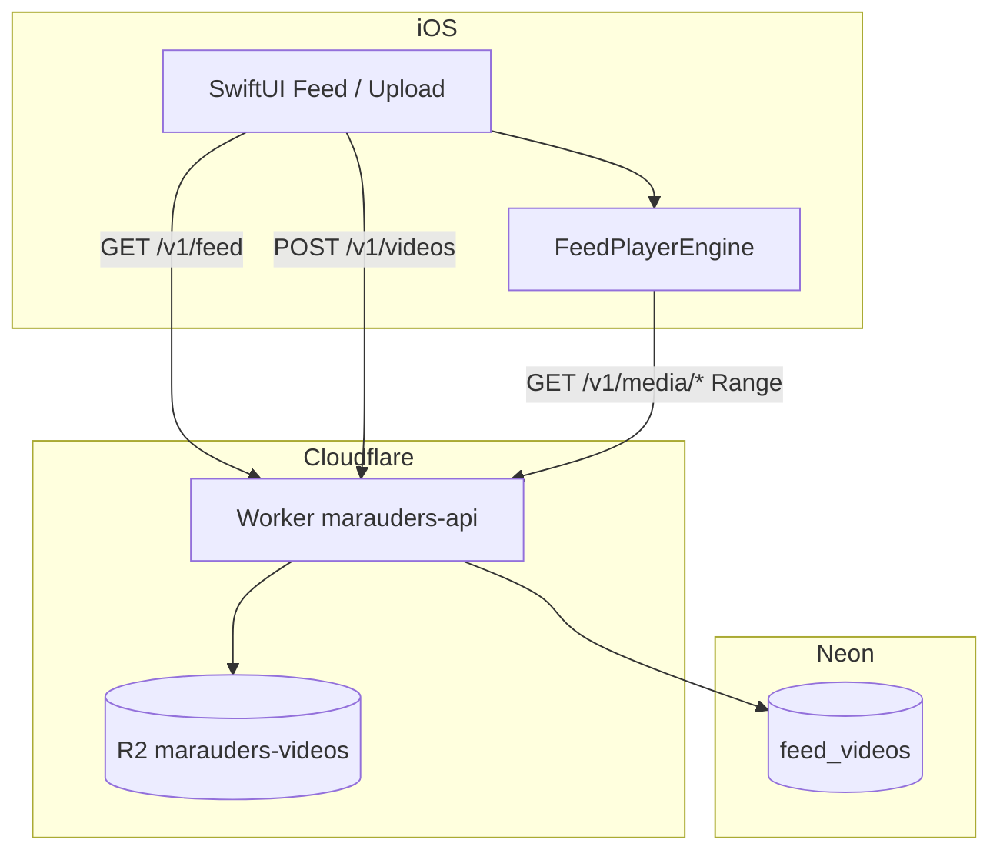

# Marauders — Architecture

Portfolio vertical-video app: **SwiftUI + AVFoundation** on iOS, **Cloudflare Workers + R2 + Neon** on the backend.

## System context



| Surface | Responsibility |
|---------|----------------|
| `GET /v1/feed` | Paginated list of `{ id, streamURL }` |
| `POST /v1/videos` | Multipart `file` → R2 + DB row |
| `GET /v1/media/{key}` | Bytes + **HTTP Range (206)** for AVPlayer |

Details: [deployment/video-pipeline.md](deployment/video-pipeline.md) (faststart, optional HLS).

---

## iOS — feed playback

### Problem

Per-cell `AVPlayer` instances caused teardown races and stutter when paging vertically (TikTok-style feed).

### Decision: single shared player

- `ScrollView` + paging only provides **layout slots** (`VideoFeedPageView`).
- One `FeedPlayerEngine` owns `AVPlayer` + `AVPlayerLayer`, rendered via `FeedPlayerSurface` overlay.
- `scrollPosition` drives `currentVideoID` → `play(url:)` on the active clip.

### Prefetch

- Neighbors (previous, next, next+1) call `prefetch(url:)`.
- Prefetch builds `AVPlayerItem` and waits until **readyToPlay**, stored in a small in-memory cache.
- On swipe, `play` swaps to a prepared item when possible → lower time-to-first-frame.

### UX / lifecycle

- **Tap** toggles play/pause; user pause uses `FeedPlayerPhase.paused`.
- **Buffering spinner** appears only after ~380 ms of stall (avoids flicker on quick switches).
- `scenePhase` and tab disappear → system `pause()`; returning → resume active URL.

### Upload path (client)

`PhotosPicker` → `VideoExportService` (H.264 720p MP4, network-optimized) → `POST /v1/videos`.

### Security (client)

- Playback URLs must be **`https`**; other schemes fail closed with a user-visible error.

### Module map

```text
Marauders-ios/Marauders/
  Feed/           VideoFeedView, FeedPlayerEngine, FeedPlayerSurface
  Upload/         UploadVideoView, VideoExportService
  Networking/     FeedAPIClient, VideoUploadAPIClient
  Logging/        AppLog, DebugLogView (#if DEBUG tab only)
```

---

## Backend — video on write and read

### Upload

1. Validate multipart `file` (size, MIME).
2. For MP4 ≤ 80 MB: **faststart** remux (`moov` before `mdat`) in the Worker.
3. `put` to R2, insert `stream_url` pointing at `/v1/media/videos/{uuid}.ext`.

### Media GET

- Validates object key (`videos/{uuid}.mp4|mov` or HLS `videos/{uuid}/master.m3u8`, `segNNN.ts`).
- `Accept-Ranges: bytes`, `ETag` / `304`, immutable cache headers.

### Operational scripts

| Script | Purpose |
|--------|---------|
| `npm run db:purge` | Clear `feed_videos` + delete R2 objects referenced by URLs |
| `npm run video:hls` | Local ffmpeg → HLS on R2 + update `stream_url` |

---

## Failure modes

| Symptom | Likely cause | Mitigation |
|---------|----------------|------------|
| Spinner forever | Bad `stream_url`, 404 media | In-app retry; fix DB/R2; purge broken rows |
| Slow start on first frame | MP4 without faststart (legacy uploads) | Re-upload or HLS script |
| Google / external 403 seeds | Removed in `003_remove_google_seeds` | `db:purge` / empty seed in `002` |

---

## Future (not implemented)

- Auth + per-user upload quotas
- Automatic HLS transcode queue (Worker Queue + ffmpeg worker)
- Metrics: time-to-first-frame, rebuffer count
- Offline cache / `AVAssetDownloadTask`

---

## Tests

- `MaraudersTests/FeedPlayerEngineTests.swift` — URL policy, pause semantics, retry (no network).
- Run: Xcode **Product → Test** or `xcodebuild test -scheme Marauders`.
