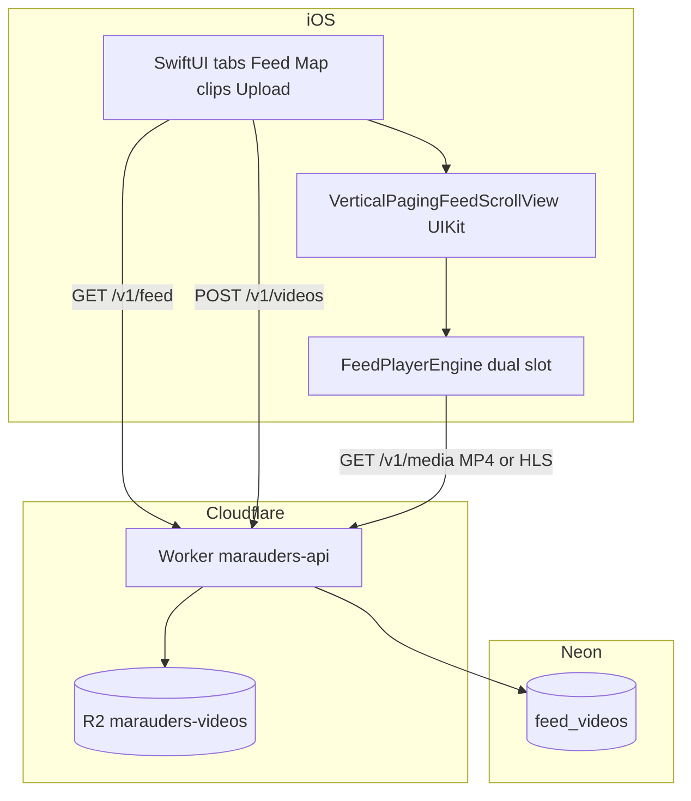
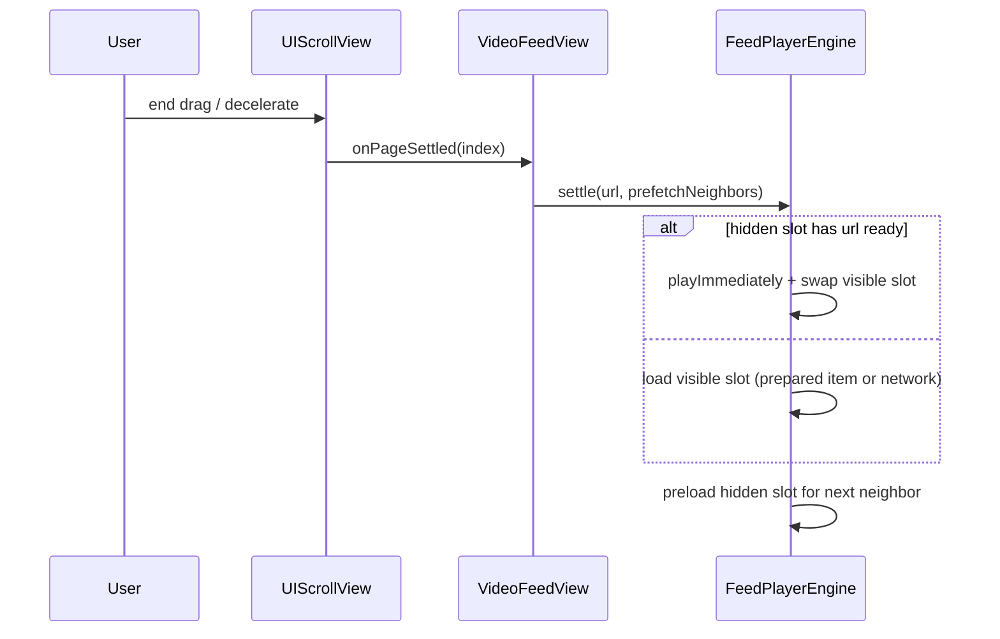
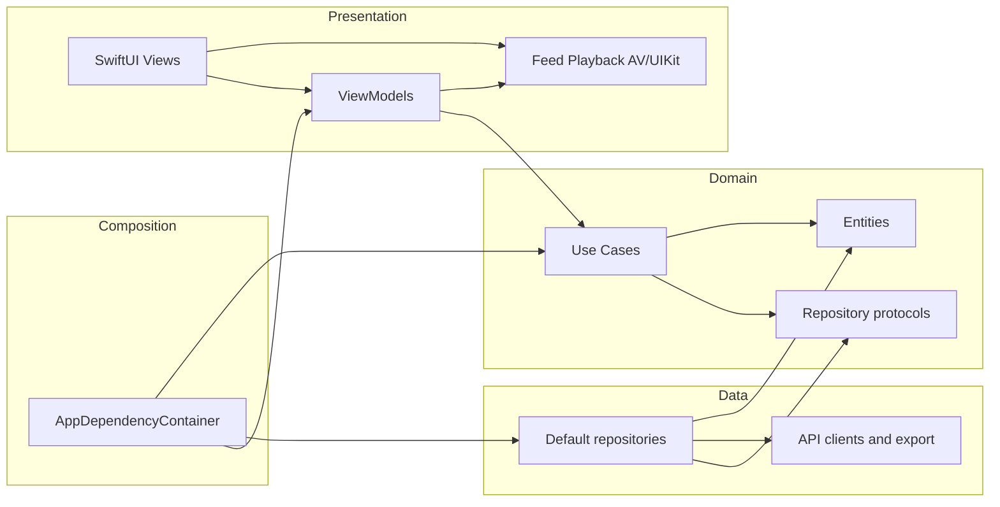
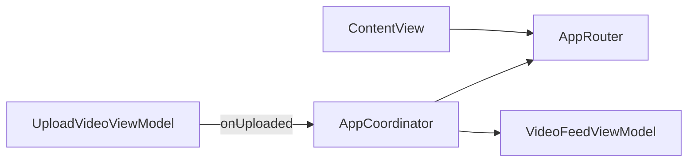
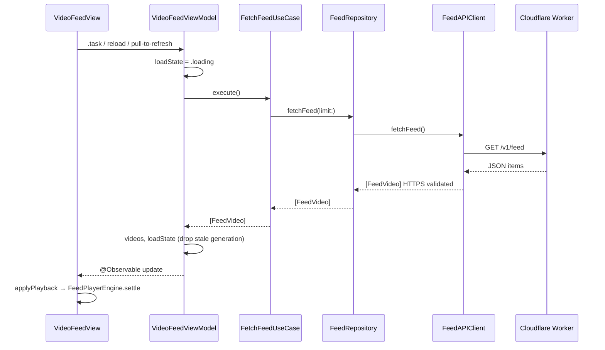
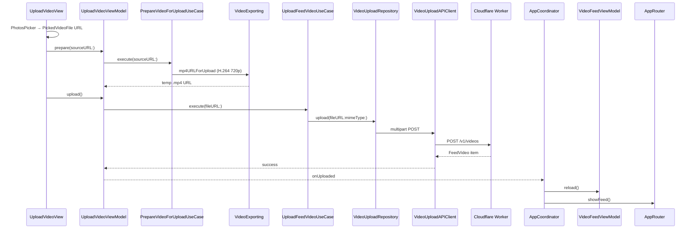
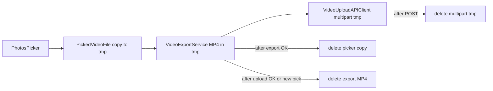

# Marauders — Architecture

Portfolio vertical-video app: **SwiftUI + AVFoundation** on iOS, **Cloudflare Workers + R2 + Neon** on the backend.

**Related:** [docs/adr/](docs/adr/) (decision records) · [deployment/video-pipeline.md](deployment/video-pipeline.md) (faststart, HLS)

## System context



| Surface | Responsibility |
|---------|----------------|
| `GET /v1/feed` | Paginated list of `{ id, streamURL }` |
| `POST /v1/videos` | Multipart `file` + `latitude` + `longitude` → R2 + DB row |
| `GET /v1/media/{key}` | Progressive MP4/MOV (**Range 206**) or HLS playlist + `.ts` segments |

---

## Trust boundaries

```text
┌─────────────────────────────────────────────────────────┐
│  iOS app (untrusted client)                             │
│  · HTTPS-only playback URLs                             │
│  · No secrets in repo; API base URL in plist            │
│  · Debug log tab: DEBUG builds only                     │
└───────────────────────────┬─────────────────────────────┘
                            │ TLS
┌───────────────────────────▼─────────────────────────────┐
│  Cloudflare Worker (validation, authz: public read)     │
│  · Reject invalid paths, MIME, size                     │
│  · DATABASE_URL via wrangler secret                     │
└───────────────┬─────────────────────┬───────────────────┘
                │                     │
         ┌──────▼──────┐       ┌──────▼──────┐
         │ Neon Postgres│       │ R2 bucket   │
         │ feed metadata│       │ video bytes │
         └─────────────┘       └─────────────┘
```

| Zone | Sensitive data | Controls |
|------|----------------|----------|
| iOS | None stored | ATS HTTPS; fail closed on non-HTTPS `streamURL` |
| Worker | `DATABASE_URL` | Secret binding; input validation on upload |
| R2 | Video objects | Key allowlist `videos/{uuid}.mp4` or `videos/{uuid}/…` |
| Neon | `stream_url`, feed rows | Parameterized SQL; pooled connection string |

---

## iOS — feed playback

See **[ADR-001: UIKit paging + dual AVPlayer](docs/adr/001-feed-playback-dual-player.md)** for options and tradeoffs.

### Problem (historical)

Per-cell `AVPlayer` instances caused teardown races. A single player in a fixed SwiftUI overlay did not scroll with the finger and stuttered on `replaceCurrentItem` when the page changed.

### Current design

| Piece | Role |
|-------|------|
| `VerticalPagingFeedScrollView` | `UIScrollView` + `isPagingEnabled`; black page placeholders |
| `FeedPlayerCompositorView` | Two `AVPlayerLayer` hosts (slot A / B); visible slot on top |
| `FeedPlayerEngine` | Dual `AVPlayer`, prefetch cache, `settle(on:prefetchNeighbors:)` |
| `VideoFeedView` | SwiftUI chrome, buffering overlay, tap → play/pause |

The compositor is a **subview of the scroll view’s content**, positioned at `y = playbackPageIndex × pageHeight`, so video moves with the user during a drag.

### Settle sequence (after finger release)



### Prefetch

- `prefetch` / `warmURLs` build `AVPlayerItem` until **readyToPlay** (cached by URL).
- On settle, visible slot prefers **prepared items**; hidden slot preloads the **next** neighbor (paused at zero).
- Buffering UI appears only after **~380 ms** of stall.

### UX / lifecycle

- **Tap** toggles play/pause (`FeedPlayerPhase.paused` when user-initiated).
- `AppRootView` splash (~650 ms min) + `loadIfNeeded` during splash.
- `scenePhase` / tab disappear → `pause()`; active → `settle` again.

### Upload path (client)

`PhotosPicker` → `PrepareVideoForUploadUseCase` / `VideoExportService` (H.264 720p MP4) → `UploadFeedVideoUseCase` → `POST /v1/videos` (includes `latitude` / `longitude` from `ClipLocation`).

### Map tab (clip pins)

- **Data:** `FeedVideo.latitude` / `longitude` from `GET /v1/feed`; `FeedVideo.mapCoordinate` when both are present.
- **Pins:** `MapView` annotates `feedViewModel.videosWithMapCoordinates`; camera fits pin bounds when the clip count changes.
- **Open in feed:** tap pin → sheet → **Play in Feed** → `AppCoordinator.openClipInFeed` reloads if needed, `requestFocus(on:)`, `router.showFeed()`; `VideoFeedView` scrolls via `focusVideoID` / `consumeFocusRequest()`.
- **Auth:** Map tab uses Sign in with Apple (same gate pattern as Upload).
- **Location:** Required to open the Map tab (gate + system permission). **Current Location** recenters the map after access is granted.

### Swift 6 concurrency

| Setting | Value |
|---------|--------|
| Language | **Swift 6** (`SWIFT_VERSION = 6`) |
| Default isolation | **MainActor** (`SWIFT_DEFAULT_ACTOR_ISOLATION`) |
| Strictness | Approachable concurrency (`SWIFT_APPROACHABLE_CONCURRENCY`) |

**Isolation model (intentional split):**

- **MainActor:** `FeedPlayerEngine`, ViewModels, `AppLogStore`, SwiftUI views — `AVPlayer` control and UI state only.
- **`FeedMediaPreparationService` (actor):** `AVURLAsset` cache, prefetch until `readyToPlay`, `beginPlaybackItem` for visible-slot loads — runs off the main actor between `await` points.
- **Sendable value types:** `FeedVideo`, `FeedPlayerPhase`, `FeedLoadState`, API DTOs, `FeedAPIClient` / `VideoUploadAPIClient` — safe across `Task` boundaries.
- **UIKit bridge:** `VerticalPagingFeedScrollView` settle callbacks use `Task { @MainActor in … }` before updating bindings / engine.
- **Feed reload:** `VideoFeedViewModel` ignores stale API results when a newer `reload()` started while the previous request was in flight.
- **Tests:** engine tests `@MainActor`; `FeedMediaPreparationServiceTests` cover HTTPS rules on the actor.

See **[ADR-002](docs/adr/002-ios-concurrency.md)** for rationale.

### MVVM + Clean Architecture

See **[ADR-003](docs/adr/003-mvvm-clean-architecture.md)**. Packaging: **[ADR-004](docs/adr/004-single-app-target.md)** (single Xcode target, folder boundaries; SPM deferred).

| Layer | Folder | Role |
|-------|--------|------|
| Composition | `Composition/` | `AppDependencyContainer` wires use cases |
| Domain | `Domain/` | `FeedVideo`, repository protocols, use cases |
| Data | `Data/` | API clients, `Default*Repository`, export |
| Presentation | `Presentation/` | SwiftUI Views + ViewModels; `Feed/Playback/` for AVFoundation |

#### Dependency rules

Single app target — boundaries are **folder + convention** ([ADR-004](docs/adr/004-single-app-target.md)). Arrows show allowed compile-time dependency direction.



| Layer | May import / call | Must not |
|-------|-------------------|----------|
| **Domain** | `Foundation` only | SwiftUI, UIKit, AVFoundation, PhotosUI, `URLSession` in use cases |
| **Data** | Domain (+ Apple frameworks needed for I/O) | SwiftUI; Presentation types |
| **Presentation (ViewModel)** | Domain use cases and entities | `FeedAPIClient`, `VideoUploadAPIClient`, concrete `Default*Repository` |
| **Presentation (View)** | ViewModels; playback types in `Feed/Playback/` | Use cases or repositories directly (except wiring in previews) |
| **Composition** | Domain, Data, Presentation ViewModels | UI layout |

**Playback exception:** `FeedPlayerEngine` is presentation infrastructure. `VideoFeedView` drives it for scroll/settle; it is not a domain use case.

#### Navigation (Coordinator / Router)

See **[ADR-005](docs/adr/005-coordinator-router.md)**.

| Type | Role |
|------|------|
| `AppRouter` | Observable tab state (`MainTab`); views bind `TabView(selection:)` |
| `AppCoordinator` | Cross-tab flows: splash feed load, upload finished → reload feed + show feed tab |
| ViewModels | Feature logic only; no direct tab switching |



#### MVVM flow (feed reload)



#### MVVM flow (upload)



(`AppCoordinator` performs reload + tab change; see ADR-005.)

### Module map

```text
Marauders-ios/Marauders/
  App/              MaraudersApp
  Composition/      AppDependencyContainer
  Domain/           Entities, Repositories (protocols), UseCases
  Data/             API/, Repositories/, Services/, Photos/
  Presentation/
    Navigation/     AppRouter, AppCoordinator, MainTab
    Main/           ContentView
    Splash/         AppRootView, SplashView
    Feed/           VideoFeedView, VideoFeedViewModel
    Feed/Playback/  FeedPlayerEngine, VerticalPagingFeedScrollView, …
    Upload/         UploadVideoView, UploadVideoViewModel
    Debug/          AppLog, DebugLogView (#if DEBUG)
```

### iOS — HTTP API contract

Clients live in `Data/API/`; ViewModels never call them directly ([ADR-003](docs/adr/003-mvvm-clean-architecture.md)). Base URL: `APIConfiguration.plist` → Info.plist (`https` origin only).

| Endpoint | Client | Method | Timeout | Client-side validation | Success | Error mapping |
|----------|--------|--------|---------|------------------------|---------|----------------|
| `/v1/feed?limit=` | `FeedAPIClient` | GET | 30s | `limit` 1…50; each `streamURL` must be **HTTPS** | `[FeedVideo]` | `invalidLimit`, `invalidResponse`, `serverError(status)`; **retry** up to 3× on 502/503/504 + transient `URLError` ([ADR-006](docs/adr/006-feed-get-retry.md)) |
| `/v1/videos` | `VideoUploadAPIClient` | POST multipart `file`, `latitude`, `longitude` | 300s | MIME `video/mp4` \| `video/quicktime`; size 1…100 MB; coords WGS84 | `FeedVideo` (+ optional lat/lng) | `unsupportedFormat`, `fileTooLarge`, `serverError(status)`, server `{ "error" }` message, `invalidResponse` |

**Tests:** `FeedAPIClientTests`, `VideoUploadAPIClientTests` use `StubURLProtocol` (no live network in CI).

**Not in MVP:** auth headers, automatic retry on **upload**, certificate pinning (ATS + HTTPS validation only).

### iOS — upload file lifecycle (staging)

User videos are **never** written to Documents or the photo library. All client-side bytes stay in **`NSTemporaryDirectory()`** until deleted.



| Stage | Location | Removed when |
|-------|----------|----------------|
| Library import | `PickedVideoFile` → tmp | After successful export, or when user picks another clip / clears |
| H.264 export | tmp `.mp4` (`uploadFileURL`) | After successful upload, failed prepare, new pick, or reset |
| Multipart body | tmp (upload client) | Immediately after `URLSession.upload` completes |

`TemporaryFileCleanup` only deletes URLs under the system temp directory (defense in depth). Logs record byte counts and outcomes, not file paths or video content.

---

## Backend — video on write and read

### Upload

1. Validate multipart `file` (size, MIME).
2. For MP4 ≤ 80 MB: **faststart** remux (`moov` before `mdat`) in the Worker.
3. `put` to R2; insert `stream_url` → `/v1/media/videos/{object-uuid}.mp4`.

`feed_videos.id` (row UUID) **≠** R2 object UUID in the path; both appear in API responses.

### HLS (optional, ops script)

`npm run video:hls -- <feed_videos.id>` downloads the row’s current MP4 (if needed), ffmpeg → `videos/{object-uuid}/master.m3u8` + `segNNN.ts`, updates `stream_url`. AVPlayer needs no app change.

### Media GET

- Keys: `videos/{uuid}.mp4|mov`, `videos/{uuid}/master.m3u8`, `videos/{uuid}/segNNN.ts`
- `Accept-Ranges: bytes`, `ETag` / `304`, `Content-Disposition: inline`

### Operational scripts

| Script | Purpose |
|--------|---------|
| `npm run db:purge` | Clear `feed_videos` + delete R2 objects referenced by URLs |
| `npm run video:hls` | ffmpeg HLS from feed row → R2 + update `stream_url` |

---

## Failure modes

| Symptom | Likely cause | Mitigation |
|---------|----------------|------------|
| Spinner forever | Bad `stream_url`, 404 media | In-app retry; fix DB/R2; `db:purge` |
| Hitch on release only | Next clip not in hidden slot | Wait on clip for prefetch; HLS; `video:hls` |
| Scroll smooth but black gap | Empty feed | Empty-state UX (planned) |
| Slow MP4 start | No faststart / large file | Re-upload; HLS script |
| Mixed HLS + MP4 in feed | By design during migration | Convert remaining rows with `video:hls` |

---

## Future (not implemented)

- Empty-state feed UI when `items.length === 0`
- Backend verification of Apple identity tokens + per-user upload quotas (**Map** and **Upload** tabs gate on **Sign in with Apple** client-side today; user ID in Keychain only)
- Automatic HLS transcode queue (Worker Queue + ffmpeg worker)
- Metrics: time-to-first-frame after settle, rebuffer count
- Adaptive HLS ladder (multi-bitrate `master.m3u8`)
- Offline cache / `AVAssetDownloadTask`

---

## Tests

- `MaraudersTests/FeedPlayerEngineTests.swift` — HTTPS policy, pause semantics, retry (no network).
- `MaraudersUITests/MaraudersUITests.swift` — smoke tests (feed tab, upload tab, empty-feed error) with deterministic mock data.
- Run: Xcode **Product → Test** or `xcodebuild test -scheme Marauders`.

### UI test launch flags (`UITEST`)

Pass these via `XCUIApplication.launchArguments` (and matching `launchEnvironment` keys where noted) so UI tests do not hit the network or wait on splash.

| Flag / env | Effect |
|------------|--------|
| `UITEST` (`UITEST=1` in env) | Composition root uses `UITestFeedRepository` instead of `DefaultFeedRepository`; splash skips the 650 ms minimum delay after the first feed load completes. |
| `UITEST_EMPTY_FEED` (`UITEST_EMPTY_FEED=1` in env) | Mock repository returns an empty list → feed shows the empty-state error UI (message contains `Feed is empty`). Requires `UITEST`. |

Resolution lives in `UITestFeedMode` / `AppRuntimeConfiguration` and is applied when `AppDependencyContainer` wires the feed repository. Splash awaits `VideoFeedViewModel.awaitInitialLoad()` so smoke tests assert against a settled feed state.

Key accessibility identifiers used by smoke tests: `feed.root`, `feed.error`, `upload.root`, `upload.pickVideo`.
