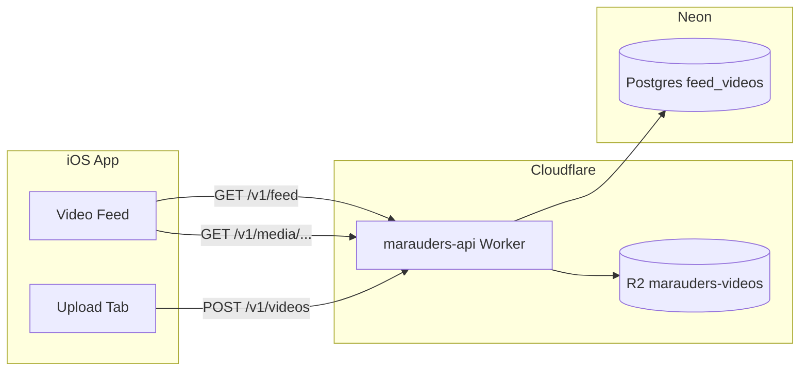

# Marauders

แอป iOS สไตล์สั้น ๆ แบบ TikTok: **ฟีดวิดีโอแนวตั้ง**, **อัปโหลดคลิป**, metadata ใน **Neon (Postgres)**, ไฟล์วิดีโอใน **Cloudflare R2**, API บน **Cloudflare Workers**

โปรเจกต์ portfolio สำหรับสมัครงาน — เน้น full-stack บน cloud จริง ไม่ใช่ mock ในเครื่องอย่างเดียว

## Features

| ส่วน | รายละเอียด |
|------|------------|
| **ฟีด** | เลื่อนแนวตั้งเต็มจอ (paging), เล่นเฉพาะคลิปที่อยู่กลางจอ |
| **อัปโหลด** | เลือกวิดีโอจากคลัง → ส่ง multipart ไป API → โผล่บนฟีด |
| **API** | REST บน Workers, validate input ฝั่งเซิร์ฟเวอร์ |
| **Debug** | แท็บ Log ในแอป + `os.Logger` (ช่วยไล่ปัญหาเครือข่าย/เล่นวิดีโอ) |

## Architecture



- **Neon** เก็บ `stream_url`, caption, `@handle`, ลำดับฟีด  
- **R2** เก็บไฟล์ `.mp4` / `.mov`  
- **Worker** อ่าน/เขียน DB, อัปโหลด/เสิร์ฟวิดีโอ (รองรับ **HTTP Range** สำหรับ AVPlayer)

## Repository layout

```text
Marauders/
├── Marauders-ios/          # SwiftUI + AVFoundation
│   └── Marauders/
│       ├── Feed/           # ฟีด, player
│       ├── Upload/         # PhotosPicker, อัปโหลด
│       ├── Networking/     # API clients
│       ├── Logging/        # In-app log + copy
│       └── APIConfiguration.plist   # Base URL ของ Worker (HTTPS)
├── backend/                # Cloudflare Worker (TypeScript)
│   ├── src/
│   ├── sql/                # schema, seed, migrations
│   └── wrangler.toml
└── deployment/             # คู่มือ deploy แบบละเอียด
```

## Prerequisites

- **Xcode** (โปรเจกต์ตั้ง iOS 26.x — ปรับ deployment target ใน Xcode ตามเครื่องคุณได้)
- **Node.js 20+** สำหรับ Worker
- บัญชี **[Neon](https://neon.tech)** และ **[Cloudflare](https://dash.cloudflare.com)** (Workers + R2)

## Quick start

### 1. Database (Neon)

```bash
cd backend
npm install
npm run db:migrate    # รัน 001_schema, 002_seed, 003_remove_google_seeds
```

หรือรัน SQL ใน Neon SQL Editor ตามไฟล์ใน `backend/sql/` ทีละไฟล์

ตั้ง connection string (ไม่ commit):

```bash
cp .env.example .dev.vars   # ใส่ DATABASE_URL สำหรับ wrangler dev / migrate
```

### 2. API (Cloudflare)

```bash
cd backend
npx wrangler login
npx wrangler r2 bucket create marauders-videos
npx wrangler secret put DATABASE_URL
npm run deploy
```

ทดสอบ:

```bash
curl "https://<your-worker>.workers.dev/v1/feed?limit=5"
```

รายละเอียดเพิ่ม: [deployment/README.md](deployment/README.md)

### 3. iOS

1. เปิด `Marauders-ios/Marauders.xcodeproj`
2. แก้ `Marauders/APIConfiguration.plist` → `MARAUDERS_API_BASE_URL` เป็น URL Worker ของคุณ (ไม่มี `/` ท้าย)
3. Run บน Simulator หรือเครื่องจริง (ต้องมีเน็ต)

## API (สรุป)

| Method | Path | คำอธิบาย |
|--------|------|----------|
| `GET` | `/health` | health check |
| `GET` | `/v1/feed?limit=20&cursor=<uuid>` | รายการฟีด (JSON) |
| `POST` | `/v1/videos` | `multipart/form-data`: `file` เท่านั้น |
| `GET` / `HEAD` | `/v1/media/videos/<uuid>.{mp4,mov}` | สตรีมไฟล์จาก R2 |

**ข้อจำกัดอัปโหลด (server):** MP4 / QuickTime, สูงสุด 100 MB

ตัวอย่าง response ฟีด:

```json
{
  "items": [
    {
      "id": "uuid",
      "streamURL": "https://.../v1/media/videos/....mp4"
    }
  ]
}
```

## Security notes (portfolio scope)

- `DATABASE_URL` เก็บใน **Wrangler secret** / `backend/.dev.vars` (gitignore) — ไม่ใส่ใน repo  
- API validate query/body ฝั่ง Worker; อัปโหลดจำกัดชนิดไฟล์และขนาด  
- แอปโหลดวิดีโอผ่าน **HTTPS** เท่านั้น  
- **ยังไม่มี auth** — เหมาะสำหรับ demo; production ควรเพิ่ม Sign in + rate limit

## Troubleshooting

| อาการ | แนวทาง |
|--------|--------|
| อัปโหลด 500 `storage write failed` | สร้าง R2 bucket `marauders-videos` แล้ว deploy Worker ใหม่ |
| ไม่พบ API URL ในแอป | ตรวจ `APIConfiguration.plist` |
| วิดีโอ seed จาก Google เล่นไม่ได้ | รัน `003_remove_google_seeds.sql` (bucket ตัวอย่าง 403) |
| `player failed` / `Cannot Open` | ลองคลิปสั้น MP4; ดูแท็บ **Log** ในแอป |

## Roadmap (ideas)

- [ ] Sign in with Apple + จำกัดอัปโหลดต่อ user  
- [ ] Rate limiting ที่ Worker  
- [ ] Like / โปรไฟล์ต่อ `@handle`  
- [ ] ซ่อนแท็บ Log ใน Release build  
- [ ] CI: `npm run typecheck` + Xcode build  

## License

Private portfolio project — ปรับ license ตามต้องการก่อนเปิด public repo
